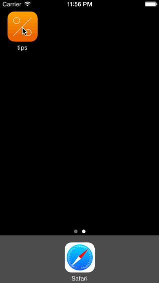

#Tip Calculator
This is a Simple Tip Calculator created as part of the application for the CodePath iOS for Designers bootcamp. 
Time spent: 2 hours for required user stories, git setup and video walkthrough. 
Time spent: 2 hours for optional user stories.

#Completed User Stories
 * [x] Required: User can enter bill amount 
 * [x] Required: User can toggle tip percentages 
 * [x] Required: User can hide numpad 
 * [x] Optional: Changed layout, colors, fonts 
 * [x] Optional: Added App Icon 
 
#Video of User Stories
 
Gif created with [LiceCap](http://www.cockos.com/licecap/)
